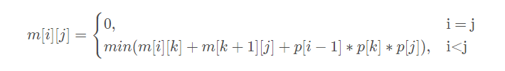

### 问题引入

学过线性代数都知道矩阵的乘法，比如说矩阵A×B，就是A的每一行上的元素分别和B的每一列上对应位置的元素相乘再总体相加，每次得到一个位置上的元素的值。

假设A是`p × q`，B是`q × r`，那结果矩阵就是`p × r`，当然，能够相乘的条件是A的列数等于B的行数。

而A×B总共需要做的乘法数是`p × q × r`，由矩阵乘法的过程可知。

可以发现，当至少3个矩阵相乘时，比如`ABC`，`(AB)C`和`(A)BC`两种计算顺序所需做的乘法数是不同的。

现在的问题是一个矩阵链，比如`A × B × C × D × E × F × G`，要以什么样的顺序相乘才能得使得所需做的乘法数最小呢？


### 题目

**输入格式:**
每个输入文件为一个测试用例，每个测试用例的第一行给出一个正整数(1≤n≤100)，表示一共有n个矩阵A​1​​ ,A​2​​ ,…,A​n​​ ，第二行给出n+1个整数P​0​​ ,P​1​​ …P​n​​ ，以空格分隔，其中1≤P​i​​ ≤100(0≤i≤n)，第i个矩阵A​i​​ 是阶为P​i−1​​ ∗P​i​​ 的矩阵。

**输出格式:**
获得上述矩阵的乘积，所需的最少乘法次数。

**输入样例:**
在这里给出一组输入。例如：

> 5  
> 30 35 15 5 10 20

**输出样例:**
在这里给出相应的输出。例如：

> 11875


### 思路

可以先求2个2个相邻相乘的值，然后用他们求3个3个相乘的，再4个...依照此规律直到n个

当前个数阶段也需要把每种划分方案进行尝试，并得出最小的那种。比如我在算4个4个相乘的，那划分位置就有3个，每个都要遍历算一次，最后选最小那个，为下一阶段使用。

我们利用二维数组m\[i\]\[j\]表示第i个到第j个矩阵连乘的最优解，有如下公式。

就是每次划分为2部分，**整体最优解=左部分最优解+右部分的最优解+两者相乘所需乘法数**

矩阵i的行数为`p[i-1]`，列数为`p[i]`



我们用一个二维矩阵来存储各阶段结果，数据就一步步往右上角填上去，最终答案就在最右上角。


### 代码

```c++
// 矩阵链相乘问题
#include <iostream>
#include <string.h>
using namespace std;

const int MAX = 1000;
int p[MAX];      // 存放行列数，就是题目输入的序列
int m[MAX][MAX]; // 存放局部和最终结果的矩阵
int n;           // 需要相乘的矩阵个数

void matrix()
{
    memset(m, 0, sizeof(m)); // 初始化矩阵为0

    // 同时连续相乘的个数
    for (int r = 2; r <= n; r++)
    {
        // 从第几个开始(到第几组了)
        for (int i = 1; i <= n - r + 1; i++)
        {
            // 相乘链的最后一个
            int j = i + r - 1;

            // 为了通过比较从而得出最小的那个，要有一个比较的初值，这里是划分第一个和其余的为2组
            m[i][j] = m[i + 1][j] + p[i - 1] * p[i] * p[j];

            // 一步步移动划分点
            for (int k = i + 1; k < j; k++)
            {
                // 以k位置为划分点，划分i到j的相乘链
                int t = m[i][k] + m[k + 1][j] + p[i - 1] * p[k] * p[j];
                // 比较找出最小的那个
                if (t < m[i][j])
                {
                    m[i][j] = t;
                }
            }
        }
    }
}

int main()
{
    cin >> n;
    // 输入的数字总数比矩阵个数多1
    for (int i = 0; i < n + 1; i++)
    {
        cin >> p[i];
    }
    matrix();

    // 最后答案会在右上角出现
    cout << m[1][n];
}
```


[参考博文](https://blog.csdn.net/qq_45405490/article/details/107911349)

