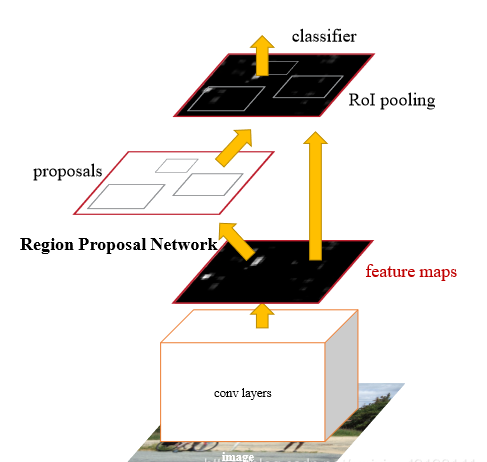
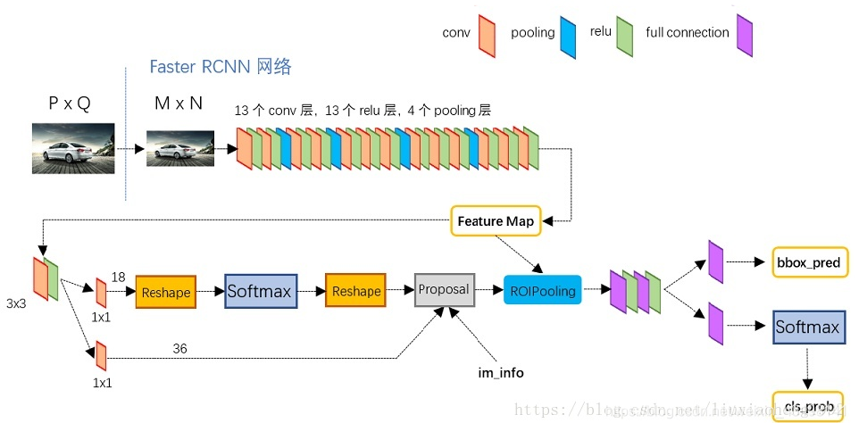
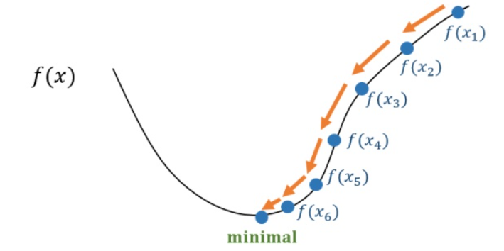
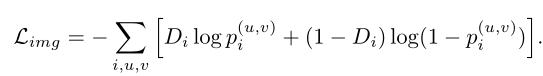
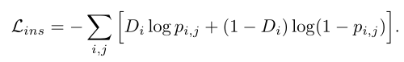
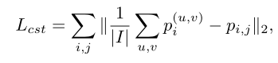
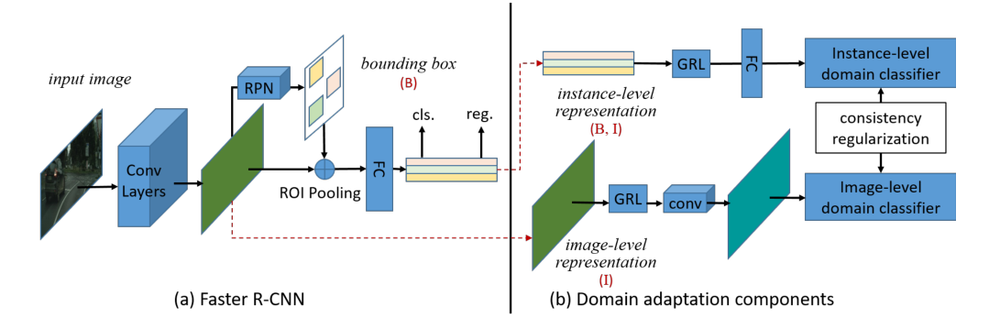
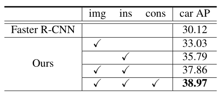

## 问题引入与研究目标

目标检测的数据集的收集往往是在现实场景中进行的，因此数据中目标的外观、背景、光照、图像质量等方面的巨大差异会导致训练数据和测试数据之间出现巨大的领域偏移。比如汽车在不同天气条件下驾驶收集到的数据，或者是相机的类型和设置的不同也会导致数据的领域偏移。这样的偏移会导致性能显著下降，尽管收集尽可能多的数据集可以降低这种影响，但是注释边界框也是一个费时费力的过程，因此开发一个新的算法来应对跨领域目标检测问题就尤为重要。

论文中方法适用于无监督场景，在源域有完整的监督，而在目标域没有监督。这样就可以不增加人工标注成本的前提下减少跨域对目标检测效率的影响。

## 关键术语介绍

### 目标检测  Object Detection

目标检测，也叫目标提取，是一种基于目标几何和统计特征的图像分割，它将目标的分割和识别合二为一，其准确性和实时性是整个系统的一项重要能力。尤其是在复杂场景中，需要对多个目标进行实时处理时，目标自动提取和识别就显得特别重要。目标检测主要有三个层次：

一是**分类**（**Classification**），即是将图像结构化为某一类别的信息，用事先确定好的类别(string)或实例ID来描述图片。这一任务是最简单、最基础的图像理解任务，也是深度学习模型最先取得突破和实现大规模应用的任务。其中，ImageNet是最权威的评测集，每年的ILSVRC催生了大量的优秀深度网络结构，为其他任务提供了基础。在应用领域，人脸、场景的识别等都可以归为分类任务。

二是**检测**（**Detection**）。分类任务关心整体，给出的是整张图片的内容描述，而检测则关注特定的物体目标，要求同时获得这一目标的类别信息和位置信息。相比分类，检测给出的是对图片前景和背景的理解，我们需要从背景中分离出感兴趣的目标，并确定这一目标的描述（类别和位置），因而，检测模型的输出是一个列表，列表的每一项使用一个数据组给出检出目标的类别和位置（常用矩形检测框的坐标表示）。

三是**分割**（**Segmentation**）。分割包括语义分割（semantic segmentation）和实例分割（instance segmentation），前者是对前背景分离的拓展，要求分离开具有不同语义的图像部分，而后者是检测任务的拓展，要求描述出目标的轮廓（相比检测框更为精细）。分割是对图像的像素级描述，它赋予每个像素类别（实例）意义，适用于理解要求较高的场景，如无人驾驶中对道路和非道路的分割。

### **领域自适应**  Domain Adaptation

**领域自适应**（Domain Adaptation）是迁移学习中的一种代表性方法，指的是利用信息丰富的源域样本来提升目标域模型的性能。
领域自适应问题中两个至关重要的概念：

**源域**（source domain）表示与测试样本不同的领域，但是有丰富的监督信息

**目标域**（target domain）表示测试样本所在的领域，无标签或者只有少量标签。**源域和目标域往往属于同一类任务，但是分布不同**

根据目标域和源域的不同类型，领域自适应问题有四类不同的场景：无监督的，有监督的，异构分布和多个源域问题。
通过在不同阶段进行领域自适应，研究者提出了三种不同的领域自适应方法：

1）**样本自适应**，对源域样本进行加权重采样，从而逼近目标域的分布。

2）**特征层面自适应**，将源域和目标域投影到公共特征子空间。

3）**模型层面自适应**，对源域误差函数进行修改，考虑目标域的误差。

### 散度  Divergence

在机器学习中，我们常常需要用一个分布Q去逼近一个目标分布P，我们希望能够找到一个目标函数D ( Q , P ) D( Q,P)*D*(*Q*,*P*)，计算Q到P的距离。而这一个目标函数，正是Divergence(散度)，比如常见的KL-Divergence，JS-Divergence等等。通过这个散度的计算我们就能不断地去优化我们的Q，寻找一个最优的参数去逼近真实的分布P。

### Faster R-CNN

Faster R-CNN是何凯明等大神在2015年提出目标检测算法，该算法在2015年的ILSVRV和COCO竞赛中获得多项第一。该算法在Fast R-CNN基础上提出了RPN候选框生成算法，使得目标检测速度大大提高。

**Faster-RCNN由下面几部分组成：**

1. 数据集，image input

2. 卷积层CNN等基础网络，提取特征得到feature map
3.  RPN层，再在经过卷积层提取到的feature map上用一个3x3的slide window，去遍历整个feature map,在遍历过程中每个window中心按rate，scale（1:2,1:1,2:1）生成9个anchors，然后再利用全连接对每个anchors做二分类（是前景还是背景）和初步bbox regression，最后输出比较精确的300个ROIs。 把经过卷积层feature map用ROI pooling固定全连接层的输入维度。
4. 然后把经过RPN输出的rois映射到ROIpooling的feature map上进行bbox回归和分类。

### 交叉熵  cross entropy

交叉熵描述了两个概率分布之间的距离，当交叉熵越小说明二者之间越接近。

在信息论中，基于相同事件测度的两个概率分布的交叉熵是指，当基于一个“非自然”（相对于“真实”分布而言）的概率分布进行编码时，在事件集合中唯一标识一个事件所需要的平均比特数。

### 梯度下降  gradient descent 

在机器学习算法中，在最小化损失函数时，可以通过梯度下降法来一步步的迭代求解，得到最小化的损失函数，和模型参数值。

梯度下降在机器学习中应用十分的广泛，不论是在线性回归还是Logistic回归中，它的主要目的是通过迭代找到目标函数的最小值，或者收敛到最小值。

## 基本思路

论文中为了解决域偏移问题，在Faster R-CNN模型中加入了图像级和实例级的两个域适应组件，从而来最小化两个域之间的h散度。在每个组件中，训练一个领域分类器，并使用对抗性训练策略来学习领域不变量的鲁棒特征。并且进一步整合不同层次的域分类器之间的一致性规则，在Faster R-CNN模型中学习一个域不变区域建议网络(RPN)。

## 研究成果

1. 从概率的角度对跨域目标检测的域移问题进行了理论分析。

2. 设计了两个域自适应组件，以缓解图像级和实例级的域差异。

3. 进一步提出了一致性正则化，以促进RPN变成领域不变的。

4. 将提出的组件集成到Faster R-CNN模型中，得到的系统可以以端到端的方式进行训练。

与用于分类的领域适应研究相比，其他计算机视觉任务的领域适应研究较少。近年来在语义分割、精细识别等方面进行了研究。对于检测任务，提出通过引入自适应支持向量机来缓解可变形零件模型(DPM)的域漂移问题。在近期的研究中，其他研究者使用R-CNN模型作为特征提取器，然后用子空间对齐方法对特征进行对齐。也有从其他来源学习探测器的工作，例如从图像到视频，从3D模型，或者从合成模型。以前的工作要么不能以端到端的方式进行培训，要么侧重于特定的案例。在这项工作中，论文作者建立了一个用于目标检测的端到端的可训练模型，也是世界上第一个。

## 领域适应组件  Domain Adaptation Components

### 映像级别适应  Image-Level Adaptation

在Faster R-CNN模型中，指的功能映射输出映像级别表示基本卷积的层。消除域分布不匹配在图像层次,采用patch-based域分类器。

这种选择的好处:

1. 对齐图像级表示通常有助于减少由全局图像差异引起的位移，如图像风格、图像尺度、光照等。类似的基于块的损失在最近的关于style  transfer的工作中也被证明是有效的，它也处理全局变换
2. 由于使用了高分辨率的输入，对于训练一个目标检测网络来说，批处理的大小通常非常小。这种基于块的设计有助于增加训练领域分类器的训练样本的数量。

用Di表示第i个训练图像的定义域标签，源域的Di= 0，目标域的Di= 1。将经过基卷积层后的第i幅图像的feature map位于(u,  v)处的激活表示为φu,v(Ii)。将域分类器的输出表示为pi(u,v)，利用交叉熵损失，图像级自适应损失可表示为:

### 实例级适应  Instance-Level Adaptation

实例级表示是指在输入到最终的类别分类器之前基于ROI的特征向量

对齐实例级表示有助于减少本地实例差异，如对象外观、大小、视点等。与图像级自适应相似，研究者训练了一个针对特征向量的领域分类器来对齐实例级分布。

将第i幅图像中第j个区域建议的实例级域分类器的输出表示为pi,j。实例级适应损失现在可以写成:

### 一致性正规化  Consistency Regularization

加强不同层次的域分类器之间的一致性有助于学习边界盒预测器(即Faster R-CNN模型中的RPN)的跨域鲁棒性。因此，研究者进一步设置了一个一致性规则。由于图像级域分类器会为图像级表示的每次激活生成一个输出，因此取图像中所有激活的平均值作为其图像级概率。一致性调节器可以写成:

## 网络概述

**Faster R-CNN与2个组件之间的整合关系如下图：**

在每一层上构建一个领域分类器，以一种对抗性的训练方式进行训练。在这两个分类器中加入了一致性规则器，以学习用于Faster R-CNN模型的领域不变RPN。

左边部分是原始的Faster R-CNN模型。底层的卷积层在所有组件之间共享。然后在其上构建RPN和ROI池化层，然后构建两个完全连接的层来提取实例级特征。

## 从合成数据中学习

随着计算机图形技术的发展，利用合成数据训练CNN变得越来越流行。尽管如此，合成的数据与真实世界的图像仍然有明显的视觉差异，并且通常与在真实数据上训练的模型存在性能差距。研究者用不同于真实世界的合成数据进行试验。

数据集:是SIM 10k由10000张由侠盗猎车手(GTA5)渲染的图像组成，在SIM 10k中，10000张训练图像中提供了58,701辆车的包围框。所有的图像都在训练中使用。Cityscapes数据集是一个城市场景数据集为驾驶场景。这些图像是由车载摄像机拍摄的。2975图像训练集,500图像验证集。使用的标记图像训练集作为目标域适应我们的检测器, 并报告结果验证集。

**结果**：不同方法的结果如下表所示。具体来说，与Faster R-CNN相比，仅使用图像级自适应组件获得+2.9%的性能提升，而仅使用实例级对齐组件获得+5.6%的性能提升。这表明，图像级适应和实例级适应组件可以有效地减少各层次上的域漂移。将这两个部分结合在一起可以得到7.7%的改进，这验证了关于减少两层域移位的必要性的猜想。通过进一步应用一致性正则化，域自适应Faster R-CNN模型将更快的R-CNN模型提高了+8.8%。

## 其它

为了验证模型的效果，研究者还通过恶劣天气中收集的图像数据、不同摄像机拍摄出来的图像数据对算法进行测试，结果都显示出不错的结果

还进一步分析了图像级和实例级适应的影响，做了有关于图像级和实例级对齐的实验，验证了模型可以从更高分辨率的图像输入中获得更好的性能结果。实验结论是从200像素增加到1000像素。

还做了实验研究了使用一致性正则化前后RPN的性能，发现RPN的性能可以进一步提高到30.3%，说明一致性调节器提高了RPN的鲁棒性。

