“工欲善其事，必先利其器”，作为后端搬砖工，我们敲代码之前需要给我们的电脑配上所需的软件环境，这样我们写的代码才能跑起来，原地起飞！

## 下载集成环境工具

可以选择xampp或phpenv（二选一就行）

### xampp

xampp = Apache + MySQL(MariaDB) + PHP + Perl，是一个集成环境软件，装了一个就可以轻松获得服务器，数据库和php语言的环境，轻松快捷而且免费，唯一的缺点可能是因为是外网所以速度稍慢或者可能需要科学上网

官网下载：[https://www.apachefriends.org/zh_cn/index.html](https://www.apachefriends.org/zh_cn/index.html)

选择自己的平台，然后点击下载，完成后运行exe

按普通安装步骤来就好，下面这个界面也默认选择就好，有些环境之后会用到

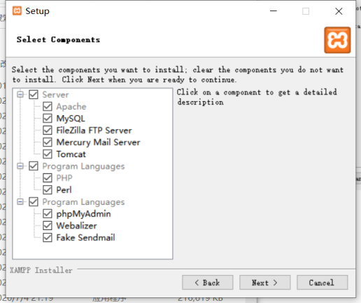

安装路径建议安装在D盘，然后等待安装完成就可以了，打开软件看到主面板

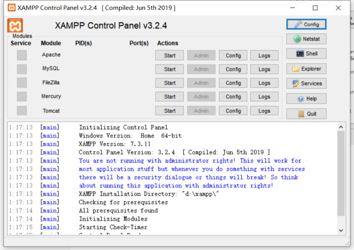

点击`Apache`和`start`按钮，等待图标变绿后再点击`admin`按钮或者浏览器地址栏输入`localhost`进行访问

如果可以看到服务器主页面说明成功

然后点击`MySQL`的`start`和`admin`，或者地址栏输入`localhost/phpmyadmin/`

出现一个登录界面，账号填写`root`，密码为空不用填，直接点击登录，出现下面画面说明成功

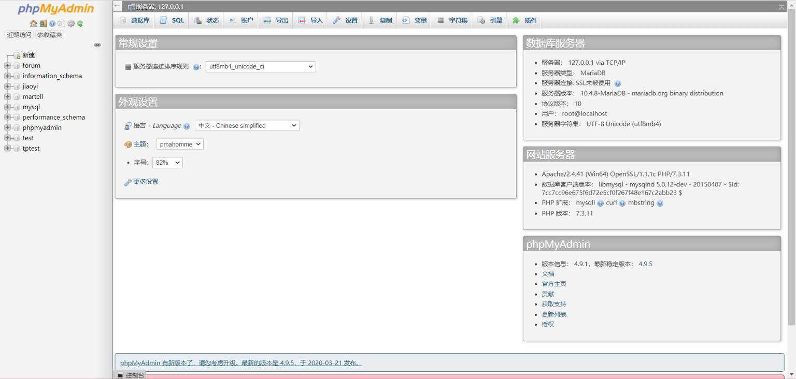


### phpEnv

如果xampp实在太慢或者根本无法下载，也可以用phpEnv

官网下载：[https://www.phpenv.cn/](https://www.phpenv.cn/)

根据你电脑是64位或者32位进行选择对应版本下载，如果不知道自己电脑是几位的可以[点击教程](https://jingyan.baidu.com/article/7f41ecec2f851a593d095c9b.html)查看

同样建议放在D盘，其它的默认就行，运行后出现下面界面

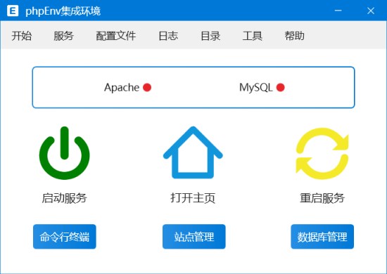

点击`启动服务`上面的图标，再点击`打开主页`的图标，看到phpEnv的主页面就说明成功了

页面拉到最下面如下

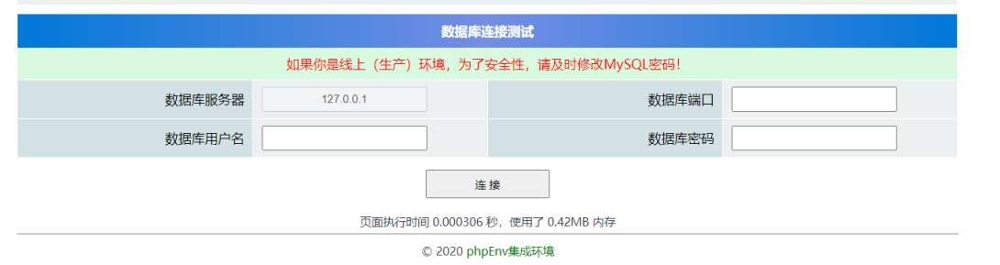

数据库端口填`3306`

用户名填`root`

密码也填`root`（注意：这里和xampp不一样）

点击连接按钮后再把页面拉到最下面显示`连接成功`就行啦

点击顶部菜单栏的`开始`，再点击`phpMyAdmin`，然后按上面xampp的对应内容操作就行


## 安装IDE

IDE(Integrated Development Environment)，集成开发环境，为开发者提供了基本的代码编辑器的同时还提供了许多适用工具，功能强大，是码农开发的利器。

php语言我们使用的比较多的是`JetBrains`公司出的`PhpStorm`

官网下载：[https://www.jetbrains.com/phpstorm/](https://www.jetbrains.com/phpstorm/)

软件体积较大，如果你不想装它的话可以自己下载`VSCode`然后下载相应插件（自己查）

由于软件是收费的，但是我们是学生，可以用学校给的邮箱进行学生认证就可以在毕业前都免费使用

学生认证地址：[https://www.jetbrains.com/community/education/#students](https://www.jetbrains.com/community/education/#students)

#### 学校邮箱获取方法

进入学校官网，进入智慧广外，	在`个人事务`中可以看到自己的邮箱地址，一般是`学号@gdufs.edu.cn`

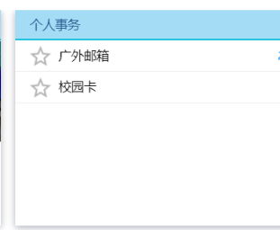

下载破解版也可以，但可能比较花时间

按步骤完成后打开phpstorm，进行下面的配置流程

### 1. 新建一个项目

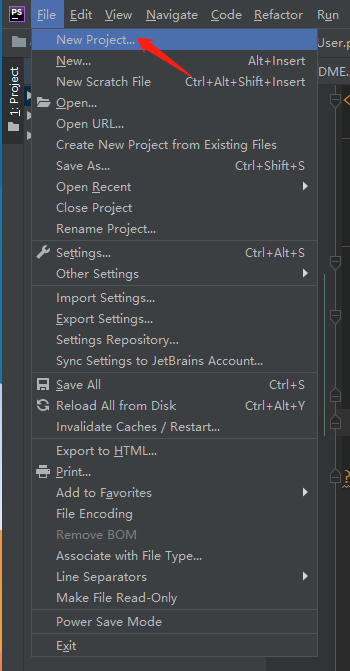

### 2. 选择创建路径

建议把目录建在集成环境指定的**网络根目录**下，目录路径如下（以安装在D盘为例）：

**xampp**：`D:\xampp\htdocs`

**phpEnv**：`D:\phpEnv\www\localhost`

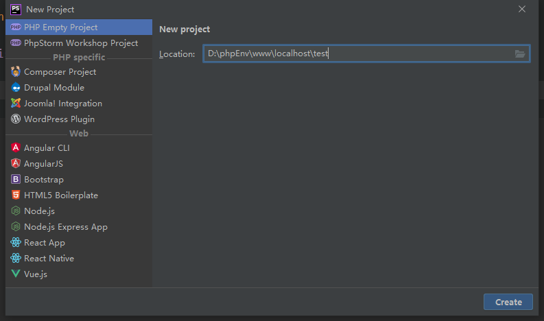

路径最后自定义一个项目名，比如我这里叫`test`，然后点击`creat`

### 3. 修改运行目录

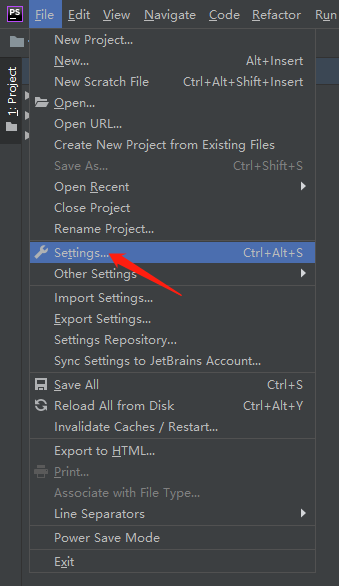

如图打开设置

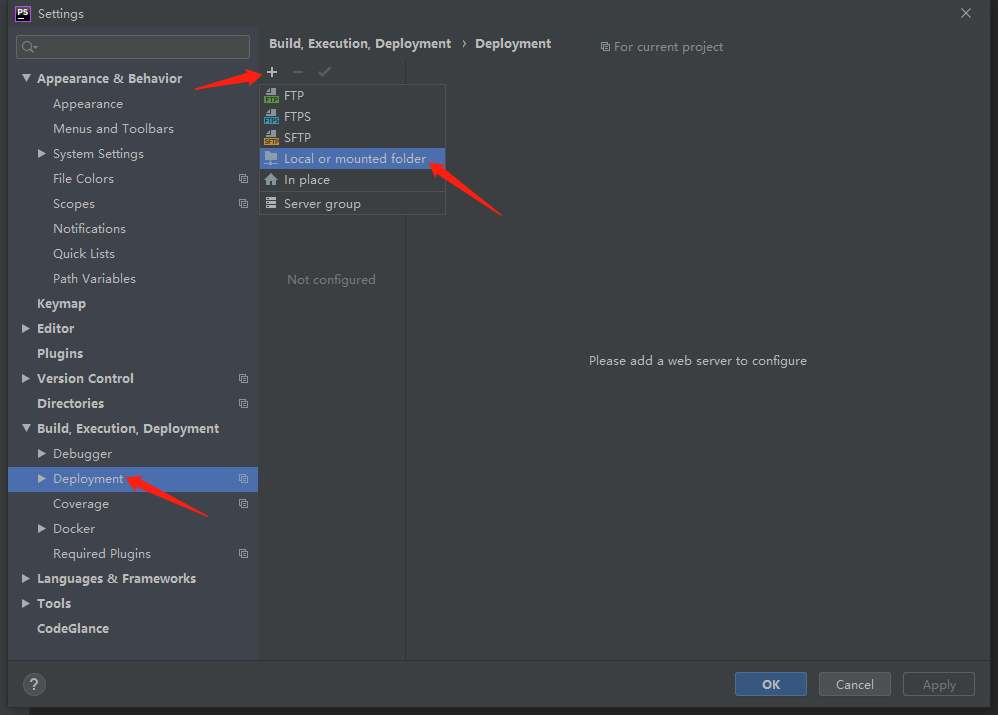

选择`Deployment`，点击顶部`+`号，选择`Local or mounted folder`

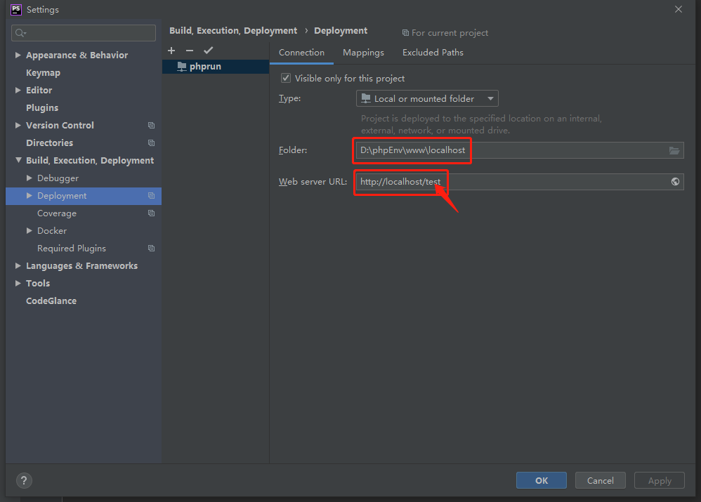

`Folder`就填写自己安装的集成环境软件的**网络根目录**

`Web server URL`记得要在最后补上**斜杆和当前项目名**

点击右下角的`Apply`和`OK`

### 4. Hello World!

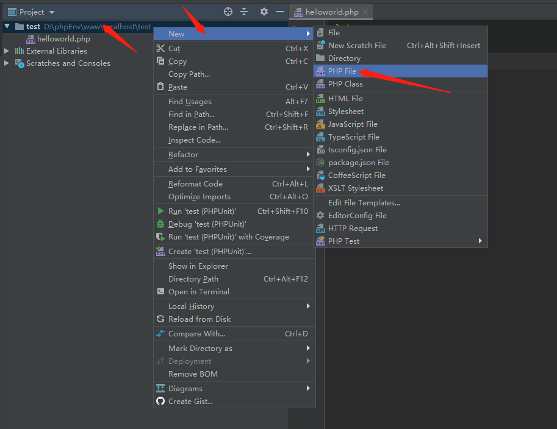

对项目文件夹右键新建一个php文件，自定义命名，然后开始写下第一行php代码吧：

```php
<?php
    echo "hello world!";
```

鼠标移到右上角选择一个浏览器运行，或者右键并选择`run`，或者快捷键`Ctrl+Shift+F10`

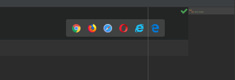

如果出现了提醒你选择php解释器的情况

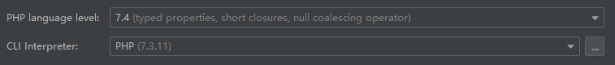

就选择一个已有的版本就行，在`settings` **->** `Languages&Frameworks`  **->** `PHP`也可以设置

点击运行后出现

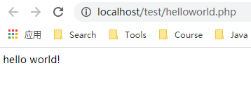

或者是

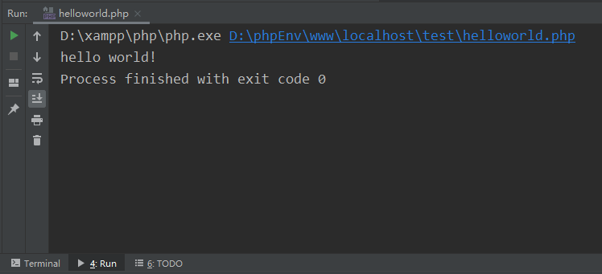

大功告成！现在可以愉快地敲代码了！

当然，这是为了方便本地开发而安装的集成环境，有兴趣的小朋友可以自己尝试分别安装每个环境或者在Linux上进行编译安装


PHPer现在可以带着世界上最好的语言开冲了！

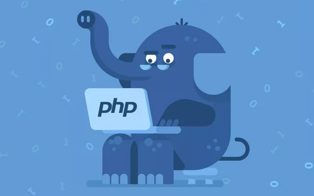